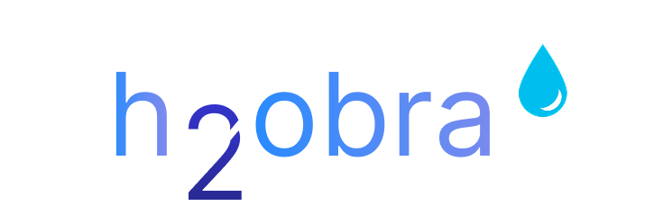

# H2OBRA - Calculadora de Pegada Hídrica para Obras

Uma solução inovadora para cálculo e gestão do consumo hídrico em projetos de construção civil.

## 📌 Visão Geral

O H2OBRA é uma plataforma web que permite:
- Cálculo preciso da pegada hídrica em obras
- Análise de consumo por categorias de materiais
- Geração de relatórios completos em PDF
- Visualização de dados através de gráficos interativos

## ✨ Funcionalidades Principais

✅ **Cálculo Automatizado**  
   - Banco de dados com 600+ itens de construção  
   - Coeficientes hídricos pré-cadastrados  

✅ **Relatórios Profissionais**  
   - Exportação para PDF com gráficos  
   - Detalhamento por categorias  

✅ **Dashboard Interativo**  
   - Gráficos de consumo  
   - Comparativo entre materiais  

✅ **Metodologia Científica**  
   - Baseado na norma ISO 14046  
   - Considera água azul, verde e cinza  

## 🛠️ Tecnologias Utilizadas

- **Frontend**: HTML5, CSS3, JavaScript (ES6+)
- **Bibliotecas**: Chart.js, jsPDF, Select2
- **Ícones**: Font Awesome
- **Fontes**: Google Fonts (Montserrat, Poppins)

## 🚀 Como Executar o Projeto

1. **Pré-requisitos**:
   - Navegador moderno (Chrome, Firefox, Edge)
   - Servidor web local (XAMPP, Live Server, etc)
